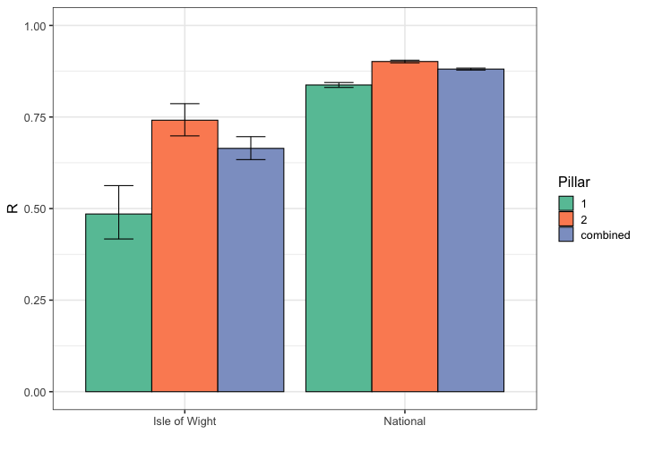
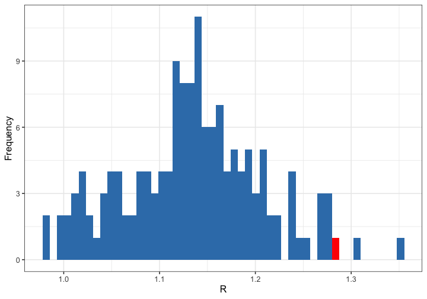
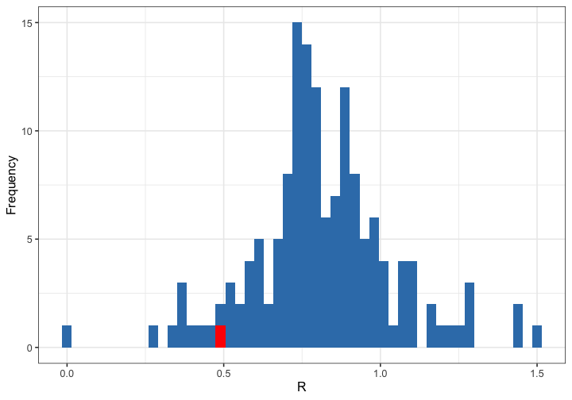

# Maximum-Likelihood estimation of R
### Michelle Kendall and Christophe Fraser


This code performs a Maximum-Likelihood estimation of R over fixed time periods before and after the Test and Trace programme, as reported in our [paper](https://doi.org/10.1016/S2589-7500(20)30241-7).

## Setup

### Load packages


```r
library(EpiEstim)
library(incidence)
library(ggplot2)
library(stats4)
library(tidyverse)
library(RColorBrewer)
```

### Load data

From the working directory, fetch the daily case data:


```r
dat.UK.p1 <- read_csv("data/pillar1_case_data.csv") # local area pillar 1 data
dat.UK.p2 <- read.csv("data/pillar2_case_data.csv") # national pillars data including pillar 2
dat.IoW.p2 <- read.csv("data/pillar2_case_data_IoW.csv") # Isle of Wight pillar 2 data
dat.UK.both <- read.csv("data/combined_pillars_case_data.csv") # local combined pillars data
```

and the population size data:


```r
population.data <- read.csv("data/population_by_region.csv", stringsAsFactors = FALSE)
```

### Extract data

Extract relevant data


```r
# Extract relevant data:
dat.Eng.p1 <- dat.UK.p1 %>% filter(Country == "England") # England only
dat.IoW.p1 <- dat.Eng.p1 %>% filter(Area == "Isle of Wight") # IoW only

dat.Eng.both <- dat.UK.both %>% filter(`Area.type` == "Upper tier local authority") # UTLAs only
dat.Eng.both.clean <- dat.Eng.both %>% select("Date"=`Specimen.date`, "Area"=`Area.name`, "Cases"=`Daily.lab.confirmed.cases`) # only the necessary columns
dat.Eng.both.clean$Date <- as.Date(dat.Eng.both.clean$Date) # restore "date" property
```


## Analysis


### Combined pillars data

Calculate incidence for each area and overall:


```r
areas.alphabetical <- sort(unique(dat.Eng.both.clean$Area)) # get a list of utlas in alphabetical order
IoW.index <- which(areas.alphabetical == "Isle of Wight")

earliest.date <- min(as.Date(dat.Eng.both.clean$Date))
last.date <- max(as.Date(dat.Eng.both.clean$Date))
all.dates <- seq(earliest.date, last.date, by=1)

# Get incidence by area, filling in any missing dates with 0 cases
incidence.each.area <- sapply(areas.alphabetical, function(area) {
  dat.area <- dat.Eng.both.clean %>% filter(Area == area)
  
  dat.area <- rbind.data.frame(dat.area,
    cbind.data.frame("Date" = as.Date(setdiff(all.dates, dat.area$Date), origin = "1970-01-01"),
                     "Area" = area,
                     "Cases" = 0)
  )

  dat.area$Cases[order(dat.area$Date)]
  
})

# extract the incidence table for the Isle of Wight
IoW.incidence <- cbind.data.frame(
  "Date" = all.dates,
  "Cases" = incidence.each.area[,IoW.index]
)

# and overall for England:
total.incidence <- cbind.data.frame(
  "Date" = all.dates,
  "Cases" = sapply(1:nrow(incidence.each.area), function(d) sum(incidence.each.area[d,]))
)

# these can be visualised for example like this:
TotalIncidencePlot <- ggplot(total.incidence, aes(x=Date, y=Cases)) +
  geom_col(fill= brewer.pal(6,"Set2")[[3]]) +
  scale_x_date(date_breaks = "2 weeks" , date_labels = "%b %d", limits=c(as.Date("2020-04-01"), last.date - 7)) +
  ylab("Daily confirmed COVID-19\ncases by swab date") +
  theme_bw(base_size = 16) 

TotalIncidencePlot
```


For England and for the Isle of Wight create their incidence line lists and `incidence` objects using data from 5 days after the TT launch and ending 5 days before the end (to allow for missing data as cases where there are delays in reporting cases.)


```r
start.date.IoW.both <- as.Date("2020-05-10")
start.date.Eng.both <- as.Date("2020-05-23")
end.date.both <- last.date - 5 

IoW.both.linelist <- IoW.incidence$Date[1]
for(row in 1:nrow(IoW.incidence)){
  if(IoW.incidence$Cases[row]>0){
    for(case in 1:IoW.incidence$Cases[row]){
      IoW.both.linelist <- c(IoW.both.linelist, IoW.incidence$Date[row])
    }
  }
}
IoW.both.linelist <- IoW.both.linelist[-1]

total.incidence$Cases[which(is.na(total.incidence$Cases))] <- 0
Eng.both.linelist <- total.incidence$Date[1]
for(row in 1:nrow(total.incidence)){
  if(total.incidence$Cases[row]>0){
    Eng.both.linelist <- c(Eng.both.linelist, rep(total.incidence$Date[row], total.incidence$Cases[row]))
  }
}
Eng.both.linelist <- Eng.both.linelist[-1]

IoW.both.incidence <- incidence(IoW.both.linelist, 
                              first_date = start.date.IoW.both,
                              last_date = end.date.both,
                              standard = FALSE)

Eng.both.incidence <- incidence(Eng.both.linelist, 
                             first_date = start.date.Eng.both,
                             last_date = end.date.both,
                             standard = FALSE)
```

Prepare log-likelihood function:

```r
minusloglik <- function(i0, r, start.date, incidence.dates, incidence.counts) {
  ll <- 0
  for(row in 1:length(incidence.dates)){
    model <- i0*exp(-r*as.numeric(difftime(start.date,incidence.dates[row],units=c("days"))))
    ll <- ll + model - incidence.counts[row]*log(model)
  }
  return(ll)
}
```

Get Maximum-Likelihood estimates for the growth rate r:


```r
fit.mle.IoW.both <- mle(minusloglik, 
                      start=list(i0=10, r=-0.01), 
                      fixed=list(start.date=start.date.IoW.both,
                                 incidence.dates=IoW.both.incidence$dates,
                                 incidence.counts=IoW.both.incidence$counts)
)
summary(fit.mle.IoW.both)
```

```
## Maximum likelihood estimation
## 
## Call:
## mle(minuslogl = minusloglik, start = list(i0 = 10, r = -0.01), 
##     fixed = list(start.date = start.date.IoW.both, incidence.dates = IoW.both.incidence$dates, 
##         incidence.counts = IoW.both.incidence$counts))
## 
## Coefficients:
##       Estimate  Std. Error
## i0  9.62302144 1.236653064
## r  -0.07209213 0.008048002
## 
## -2 log L: -110.3964
```

```r
fit.mle.Eng.both <- mle(minusloglik,
                     start=list(i0=1420, r=-0.02), 
                     fixed=list(start.date=start.date.Eng.both,
                                incidence.dates=Eng.both.incidence$dates,
                                incidence.counts=Eng.both.incidence$counts))
summary(fit.mle.Eng.both)
```

```
## Maximum likelihood estimation
## 
## Call:
## mle(minuslogl = minusloglik, start = list(i0 = 1420, r = -0.02), 
##     fixed = list(start.date = start.date.Eng.both, incidence.dates = Eng.both.incidence$dates, 
##         incidence.counts = Eng.both.incidence$counts))
## 
## Coefficients:
##         Estimate  Std. Error
## i0 1420.15949911 1.35301e+01
## r    -0.02283999 5.38094e-04
## 
## -2 log L: -410782.2
```

### Pillar 1 data

Similarly for Pillar 1 alone:

```r
dat.IoW.p1$Incidence <- rep(0,nrow(dat.IoW.p1)) 
dat.IoW.p1$Incidence[1] <- dat.IoW.p1$TotalCases[1]
for(row in 2:nrow(dat.IoW.p1)) {
  dat.IoW.p1$Incidence[row] <- dat.IoW.p1$TotalCases[row] - dat.IoW.p1$TotalCases[row-1]
}


dat.Eng.p1 <- dat.UK.p1 %>% filter(Country == "England")

incidence.all.areas.p1 <- sapply(areas.alphabetical, function(area) {
  dat.area <- dat.Eng.p1 %>% filter(Area == area)
  
  new.dat.area <- data.frame("Date" = unique(dat.Eng.p1$Date))
  new.dat.area$TotalCases <- sapply(new.dat.area$Date, function(d) (dat.area %>% filter(Date == d))$TotalCases)
  # fill in the blanks
  if (length(new.dat.area$TotalCases[[1]])==0) new.dat.area$TotalCases[[1]] <- 0
  for (i in 1:nrow(new.dat.area)) {
    if (length(new.dat.area$TotalCases[[i]])==0) new.dat.area$TotalCases[[i]] <- new.dat.area$TotalCases[[i-1]]
  }
  
  new.dat.area$Incidence <- rep(0,nrow(new.dat.area))
  new.dat.area$Incidence[[1]] <- new.dat.area$TotalCases[[1]]
  for(row in 2:nrow(new.dat.area)) new.dat.area$Incidence[[row]] <- new.dat.area$TotalCases[[row]] - new.dat.area$TotalCases[[row-1]]
  
  new.dat.area$Incidence
})

Eng.Pillar1 <- cbind.data.frame(
  "Date" = unique(dat.Eng.p1$Date),
  "Incidence" = sapply(1:nrow(incidence.all.areas.p1), function(row) {
    sum(incidence.all.areas.p1[row,], na.rm=TRUE)
  })
)


# linelists
IoW.p1.linelist <- dat.IoW.p1$Date[1]
for(row in 1:nrow(dat.IoW.p1)){
  if(dat.IoW.p1$Incidence[row]>0){
    for(case in 1:dat.IoW.p1$Incidence[row]){
      IoW.p1.linelist <- c(IoW.p1.linelist, dat.IoW.p1$Date[row])
    }
  }
}
IoW.p1.linelist <- IoW.p1.linelist[-1]

Eng.p1.linelist <- Eng.Pillar1$Date[1]
for(row in 1:nrow(Eng.Pillar1)){
  if ((!is.na(Eng.Pillar1$Incidence[row]))&&(Eng.Pillar1$Incidence[row]>0)){
    Eng.p1.linelist <- c(Eng.p1.linelist, rep(Eng.Pillar1$Date[row], Eng.Pillar1$Incidence[row]))
  }
}
Eng.p1.linelist <- Eng.p1.linelist[-1]
```

### Pillar 2 data

And Pillar 2:

```r
dat.IoW.p2$specimen_date <- as.Date(as.character(dat.IoW.p2$specimen_date), "%d-%b-%y")
dat.IoW.p2$Pillar2 <- sapply(dat.IoW.p2$Pillar2, function(x)(if(!is.na(x)) return(x) else return(0)))

dat.UK.p2$Date.of.activity <- as.Date(dat.UK.p2$Date.of.activity, "%d/%m/%y")
UKPillar2 <- dat.UK.p2 %>% filter(Pillar == "Pillar 2 (excluding Wales)")
stopifnot(unique(UKPillar2$Nation) == "UK") # check we've just got the UK entries
UKPillar2$Daily.number.of.positive.cases <- sapply(UKPillar2$Daily.number.of.positive.cases, function(x)(if(!is.na(x)) return(x) else return(0)))

IoW.p2.linelist <- dat.IoW.p2$specimen_date[1]
for(row in 1:nrow(dat.IoW.p2)){
  if(dat.IoW.p2$Pillar2[row]>0){
    for(case in 1:dat.IoW.p2$Pillar2[row]){
      IoW.p2.linelist <- c(IoW.p2.linelist, dat.IoW.p2$specimen_date[row])
    }
  }
}
IoW.p2.linelist <- IoW.p2.linelist[-1]

UK.p2.linelist <- UKPillar2$Date.of.activity[1]
for(row in 1:nrow(UKPillar2)){
  if(UKPillar2$Daily.number.of.positive.cases[row]>0){
   UK.p2.linelist <- c(UK.p2.linelist, rep(UKPillar2$Date.of.activity[row], UKPillar2$Daily.number.of.positive.cases[row]))
  }
}
UK.p2.linelist <- UK.p2.linelist[-1]
```


Get `incidence` objects and Maximum-Likelihood estimates for the individual pillars data, starting 10 days after TT launch for Pillar 1 and 5 days after for Pillar 2 (to reflect the different typical times between symptom onset and swab).


```r
start.date.IoW.p1 <- as.Date("2020-05-15")
start.date.IoW.p2 <- as.Date("2020-05-10")
start.date.Eng.p1 <- as.Date("2020-05-28")
start.date.UK.p2 <- as.Date("2020-05-23")

end.date.IoW.p1 <- max(Eng.Pillar1$Date) - 5 
end.date.Eng.p1 <- max(Eng.Pillar1$Date) - 5
end.date.UK.p2 <- max(UKPillar2$Date.of.activity, na.rm = TRUE) - 5 
end.date.IoW.p2 <- end.date.UK.p2 # there were no more cases after the 13th

IoW.p1.incidence <- incidence(IoW.p1.linelist, 
                              first_date = start.date.IoW.p1,
                              last_date = end.date.IoW.p1,
                              standard = FALSE)

Eng.p1.incidence <- incidence(Eng.p1.linelist, 
                             first_date = start.date.Eng.p1,
                             last_date = end.date.Eng.p1,
                             standard = FALSE)

IoW.p2.incidence <- incidence(IoW.p2.linelist, 
                           first_date = start.date.IoW.p2,
                           last_date = end.date.IoW.p2,
                           standard = FALSE)

UK.p2.incidence <- incidence(UK.p2.linelist, 
                          first_date = start.date.UK.p2,
                          last_date = end.date.UK.p2,
                          standard = FALSE)
```


```r
fit.mle.IoW.p1 <- mle(minusloglik, 
                      start=list(i0=10, r=-0.01), 
                      fixed=list(start.date=start.date.IoW.p1,
                                 incidence.dates=IoW.p1.incidence$dates,
                                 incidence.counts=IoW.p1.incidence$counts)
)
summary(fit.mle.IoW.p1)
```

```
## Maximum likelihood estimation
## 
## Call:
## mle(minuslogl = minusloglik, start = list(i0 = 10, r = -0.01), 
##     fixed = list(start.date = start.date.IoW.p1, incidence.dates = IoW.p1.incidence$dates, 
##         incidence.counts = IoW.p1.incidence$counts))
## 
## Coefficients:
##      Estimate Std. Error
## i0  3.6521234 0.92358594
## r  -0.1245396 0.02442024
## 
## -2 log L: 37.98268
```

```r
fit.mle.Eng.p1 <- mle(minusloglik,
                     start=list(i0=10, r=-0.03), 
                     fixed=list(start.date=start.date.Eng.p1,
                                incidence.dates=Eng.p1.incidence$dates,
                                incidence.counts=Eng.p1.incidence$counts))
summary(fit.mle.Eng.p1)
```

```
## Maximum likelihood estimation
## 
## Call:
## mle(minuslogl = minusloglik, start = list(i0 = 10, r = -0.03), 
##     fixed = list(start.date = start.date.Eng.p1, incidence.dates = Eng.p1.incidence$dates, 
##         incidence.counts = Eng.p1.incidence$counts))
## 
## Coefficients:
##        Estimate  Std. Error
## i0 417.30047597 8.265965851
## r   -0.03182554 0.001423115
## 
## -2 log L: -73446.41
```

```r
fit.mle.IoW.p2 <- mle(minusloglik, 
                   start=list(i0=10, r=-0.01), 
                   fixed=list(start.date=start.date.IoW.p2,
                              incidence.dates=IoW.p2.incidence$dates,
                              incidence.counts=IoW.p2.incidence$counts)
                   )
summary(fit.mle.IoW.p2)
```

```
## Maximum likelihood estimation
## 
## Call:
## mle(minuslogl = minusloglik, start = list(i0 = 10, r = -0.01), 
##     fixed = list(start.date = start.date.IoW.p2, incidence.dates = IoW.p2.incidence$dates, 
##         incidence.counts = IoW.p2.incidence$counts))
## 
## Coefficients:
##       Estimate Std. Error
## i0  4.90650182 0.85101721
## r  -0.05320915 0.01030546
## 
## -2 log L: 17.73932
```

```r
fit.mle.UK.p2 <- mle(minusloglik,
                     start=list(i0=10, r=-0.02), 
                     fixed=list(start.date=start.date.UK.p2,
                                incidence.dates=UK.p2.incidence$dates,
                                incidence.counts=UK.p2.incidence$counts))
summary(fit.mle.UK.p2)
```

```
## Maximum likelihood estimation
## 
## Call:
## mle(minuslogl = minusloglik, start = list(i0 = 10, r = -0.02), 
##     fixed = list(start.date = start.date.UK.p2, incidence.dates = UK.p2.incidence$dates, 
##         incidence.counts = UK.p2.incidence$counts))
## 
## Coefficients:
##         Estimate   Std. Error
## i0 1393.11365688 1.447956e+01
## r    -0.01870897 7.094076e-04
## 
## -2 log L: -368702.5
```

Plot these results for comparison:

```r
# function to convert from growth rate r to reproduction number R
alpha <- 6.6
beta <- 1.2
R <- function(r) ((beta + r)/beta)^alpha

# gather results, converting r to R:
results.for.plotting <- cbind.data.frame(
  "Where" =c(rep("Isle of Wight",3), rep("National",3)),
  "Pillar" = c(1,2,"combined",1,2,"combined"),
  "R" = c(R(attributes(fit.mle.IoW.p1)$coef[[2]]),
          R(attributes(fit.mle.IoW.p2)$coef[[2]]),
          R(attributes(fit.mle.IoW.both)$coef[[2]]), 
          R(attributes(fit.mle.Eng.p1)$coef[[2]]),
          R(attributes(fit.mle.UK.p2)$coef[[2]]),
          R(attributes(fit.mle.Eng.both)$coef[[2]])
          ),
  "lower" = c(R(attributes(fit.mle.IoW.p1)$coef[[2]] - attributes(summary(fit.mle.IoW.p1))$coef[[4]]),
              R(attributes(fit.mle.IoW.p2)$coef[[2]] - attributes(summary(fit.mle.IoW.p2))$coef[[4]]),
              R(attributes(fit.mle.IoW.both)$coef[[2]] - attributes(summary(fit.mle.IoW.both))$coef[[4]]),
              R(attributes(fit.mle.Eng.p1)$coef[[2]] - attributes(summary(fit.mle.Eng.p1))$coef[[4]]),
              R(attributes(fit.mle.UK.p2)$coef[[2]] - attributes(summary(fit.mle.UK.p2))$coef[[4]]),
              R(attributes(fit.mle.Eng.both)$coef[[2]] - attributes(summary(fit.mle.Eng.both))$coef[[4]])
              ),
  "upper" = c(R(attributes(fit.mle.IoW.p1)$coef[[2]] + attributes(summary(fit.mle.IoW.p1))$coef[[4]]),
              R(attributes(fit.mle.IoW.p2)$coef[[2]] + attributes(summary(fit.mle.IoW.p2))$coef[[4]]),
              R(attributes(fit.mle.IoW.both)$coef[[2]] + attributes(summary(fit.mle.IoW.both))$coef[[4]]),
              R(attributes(fit.mle.Eng.p1)$coef[[2]] + attributes(summary(fit.mle.Eng.p1))$coef[[4]]),
              R(attributes(fit.mle.UK.p2)$coef[[2]] + attributes(summary(fit.mle.UK.p2))$coef[[4]]),
              R(attributes(fit.mle.Eng.both)$coef[[2]] + attributes(summary(fit.mle.Eng.both))$coef[[4]])
              )
)

ggplot(results.for.plotting, aes(x=Where, y=R, fill=Pillar)) + 
  geom_bar(stat="identity", color="black", 
           position=position_dodge(0.9)) +
  geom_errorbar(aes(ymin=lower, ymax=upper), width=.4,
                position=position_dodge(.9)) +
  scale_fill_manual(values=brewer.pal(6, "Set2")[1:3]) +
  xlab("") +
  ylim(0,1) +
  theme_bw(base_size = 16)
```



We use likelihood ratio tests to obtain p-values for the differences in R seen between the Isle of Wight and the national level.


```r
# prepare function for Maximum-likelihood estimation where we allow r to vary between the two datasets:
minusloglik.both.different.rs <- function(i0_1, i0_2, r_1, r_2, start.date, incidence.dates_1, incidence.dates_2, incidence.counts_1, incidence.counts_2) {
  ll_1 <- 0
  for(row in 1:length(incidence.dates_1)){
    model_1 <- i0_1*exp(-r_1*as.numeric(difftime(start.date,incidence.dates_1[row],units=c("days"))))
    ll_1 <- ll_1 + model_1 - incidence.counts_1[row]*log(model_1)
  }
  ll_2 <- 0
  for(row in 1:length(incidence.dates_2)){
    model_2 <- i0_2*exp(-r_2*as.numeric(difftime(start.date,incidence.dates_2[row],units=c("days"))))
    ll_2 <- ll_2 + model_2 - incidence.counts_2[row]*log(model_2)
  }
  return(ll_1 + ll_2)
}

#... and where we force r to be the same for both
minusloglik.both.same.r <- function(i0_1, i0_2, r, start.date, incidence.dates_1, incidence.dates_2, incidence.counts_1, incidence.counts_2) {
  ll_1 <- 0
  for(row in 1:length(incidence.dates_1)){
    model_1 <- i0_1*exp(-r*as.numeric(difftime(start.date,incidence.dates_1[row],units=c("days"))))
    ll_1 <- ll_1 + model_1 - incidence.counts_1[row]*log(model_1)
  }
  ll_2 <- 0
  for(row in 1:length(incidence.dates_2)){
    model_2 <- i0_2*exp(-r*as.numeric(difftime(start.date,incidence.dates_2[row],units=c("days"))))
    ll_2 <- ll_2 + model_2 - incidence.counts_2[row]*log(model_2)
  }
  return(ll_1 + ll_2)
}

# Pillar 1:
fit.mle.both.different.rs.p1 <- mle(minusloglik.both.different.rs, 
                       start=list(i0_1=attributes(fit.mle.Eng.p1)$coef[[1]],
                                  i0_2=attributes(fit.mle.IoW.p1)$coef[[1]],
                                  r_1=attributes(fit.mle.Eng.p1)$coef[[2]],
                                  r_2=attributes(fit.mle.IoW.p1)$coef[[2]]), 
                       fixed=list(start.date=start.date.Eng.p1,
                                  incidence.dates_1=Eng.p1.incidence$dates,
                                  incidence.dates_2=IoW.p1.incidence$dates,
                                  incidence.counts_1=Eng.p1.incidence$counts,
                                  incidence.counts_2=IoW.p1.incidence$counts)
)
summary(fit.mle.both.different.rs.p1)
```

```
## Maximum likelihood estimation
## 
## Call:
## mle(minuslogl = minusloglik.both.different.rs, start = list(i0_1 = attributes(fit.mle.Eng.p1)$coef[[1]], 
##     i0_2 = attributes(fit.mle.IoW.p1)$coef[[1]], r_1 = attributes(fit.mle.Eng.p1)$coef[[2]], 
##     r_2 = attributes(fit.mle.IoW.p1)$coef[[2]]), fixed = list(start.date = start.date.Eng.p1, 
##     incidence.dates_1 = Eng.p1.incidence$dates, incidence.dates_2 = IoW.p1.incidence$dates, 
##     incidence.counts_1 = Eng.p1.incidence$counts, incidence.counts_2 = IoW.p1.incidence$counts))
## 
## Coefficients:
##         Estimate  Std. Error
## i0_1 417.4298571 8.270174204
## i0_2   0.7453121 0.168847399
## r_1   -0.0318449 0.001423374
## r_2   -0.1228450 0.024089082
## 
## -2 log L: -73408.41
```

```r
# versus
fit.mle.both.same.r.p1 <- mle(minusloglik.both.same.r, 
                                 start=list(i0_1=attributes(fit.mle.Eng.p1)$coef[[1]],
                                            i0_2=attributes(fit.mle.IoW.p1)$coef[[1]],
                                            r=attributes(fit.mle.IoW.p1)$coef[[2]]), 
                                 fixed=list(start.date=start.date.Eng.p1,
                                            incidence.dates_1=Eng.p1.incidence$dates,
                                            incidence.dates_2=IoW.p1.incidence$dates,
                                            incidence.counts_1=Eng.p1.incidence$counts,
                                            incidence.counts_2=IoW.p1.incidence$counts)
)
summary(fit.mle.both.same.r.p1)
```

```
## Maximum likelihood estimation
## 
## Call:
## mle(minuslogl = minusloglik.both.same.r, start = list(i0_1 = attributes(fit.mle.Eng.p1)$coef[[1]], 
##     i0_2 = attributes(fit.mle.IoW.p1)$coef[[1]], r = attributes(fit.mle.IoW.p1)$coef[[2]]), 
##     fixed = list(start.date = start.date.Eng.p1, incidence.dates_1 = Eng.p1.incidence$dates, 
##         incidence.dates_2 = IoW.p1.incidence$dates, incidence.counts_1 = Eng.p1.incidence$counts, 
##         incidence.counts_2 = IoW.p1.incidence$counts))
## 
## Coefficients:
##          Estimate  Std. Error
## i0_1 419.24054384 8.266962872
## i0_2   0.88376372 0.158762267
## r     -0.03226086 0.001417704
## 
## -2 log L: -73388
```

```r
# likelihood ratio test
ll.diff.p1 <- attributes(fit.mle.both.different.rs.p1)$details$value - attributes(fit.mle.both.same.r.p1)$details$value
1 - pchisq(-2*ll.diff.p1, df=1) # p-value for the Pillar 1 difference
```

```
## [1] 6.247387e-06
```

```r
# Pillar 2
fit.mle.both.different.rs.p2 <- mle(minusloglik.both.different.rs, 
                                    start=list(i0_1=attributes(fit.mle.UK.p2)$coef[[1]],
                                               i0_2=attributes(fit.mle.IoW.p2)$coef[[1]],
                                               r_1=attributes(fit.mle.UK.p2)$coef[[2]],
                                               r_2=attributes(fit.mle.IoW.p2)$coef[[2]]), 
                                    fixed=list(start.date=start.date.UK.p2,
                                               incidence.dates_1=UK.p2.incidence$dates,
                                               incidence.dates_2=IoW.p2.incidence$dates,
                                               incidence.counts_1=UK.p2.incidence$counts,
                                               incidence.counts_2=IoW.p2.incidence$counts)
)
summary(fit.mle.both.different.rs.p2)
```

```
## Maximum likelihood estimation
## 
## Call:
## mle(minuslogl = minusloglik.both.different.rs, start = list(i0_1 = attributes(fit.mle.UK.p2)$coef[[1]], 
##     i0_2 = attributes(fit.mle.IoW.p2)$coef[[1]], r_1 = attributes(fit.mle.UK.p2)$coef[[2]], 
##     r_2 = attributes(fit.mle.IoW.p2)$coef[[2]]), fixed = list(start.date = start.date.UK.p2, 
##     incidence.dates_1 = UK.p2.incidence$dates, incidence.dates_2 = IoW.p2.incidence$dates, 
##     incidence.counts_1 = UK.p2.incidence$counts, incidence.counts_2 = IoW.p2.incidence$counts))
## 
## Coefficients:
##           Estimate   Std. Error
## i0_1 1393.20356459 1.456674e+01
## i0_2    2.45565631 2.679404e-01
## r_1    -0.01871245 7.123682e-04
## r_2    -0.05329539 1.031270e-02
## 
## -2 log L: -368684.7
```

```r
# versus
fit.mle.both.same.r.p2 <- mle(minusloglik.both.same.r, 
                              start=list(i0_1=attributes(fit.mle.UK.p2)$coef[[1]],
                                         i0_2=attributes(fit.mle.IoW.p2)$coef[[1]],
                                         r=attributes(fit.mle.IoW.p2)$coef[[2]]), 
                              fixed=list(start.date=start.date.UK.p2,
                                         incidence.dates_1=UK.p2.incidence$dates,
                                         incidence.dates_2=IoW.p2.incidence$dates,
                                         incidence.counts_1=UK.p2.incidence$counts,
                                         incidence.counts_2=IoW.p2.incidence$counts)
)
summary(fit.mle.both.same.r.p2)
```

```
## Maximum likelihood estimation
## 
## Call:
## mle(minuslogl = minusloglik.both.same.r, start = list(i0_1 = attributes(fit.mle.UK.p2)$coef[[1]], 
##     i0_2 = attributes(fit.mle.IoW.p2)$coef[[1]], r = attributes(fit.mle.IoW.p2)$coef[[2]]), 
##     fixed = list(start.date = start.date.UK.p2, incidence.dates_1 = UK.p2.incidence$dates, 
##         incidence.dates_2 = IoW.p2.incidence$dates, incidence.counts_1 = UK.p2.incidence$counts, 
##         incidence.counts_2 = IoW.p2.incidence$counts))
## 
## Coefficients:
##           Estimate   Std. Error
## i0_1 1393.25376542 1.448884e+01
## i0_2    2.28067835 2.489439e-01
## r      -0.01876948 7.088273e-04
## 
## -2 log L: -368672.6
```

```r
# likelihood ratio test
ll.diff.p2 <- attributes(fit.mle.both.different.rs.p2)$details$value - attributes(fit.mle.both.same.r.p2)$details$value
1 - pchisq(-2*ll.diff.p2, df=1) # p-value for the Pillar 2 difference
```

```
## [1] 0.0005050828
```

```r
# Combined pillars
fit.mle.both.different.rs.both <- mle(minusloglik.both.different.rs, 
                                    start=list(i0_1=attributes(fit.mle.Eng.both)$coef[[1]],
                                               i0_2=attributes(fit.mle.IoW.both)$coef[[1]],
                                               r_1=attributes(fit.mle.Eng.both)$coef[[2]],
                                               r_2=attributes(fit.mle.IoW.both)$coef[[2]]), 
                                    fixed=list(start.date=start.date.Eng.both,
                                               incidence.dates_1=Eng.both.incidence$dates,
                                               incidence.dates_2=IoW.both.incidence$dates,
                                               incidence.counts_1=Eng.both.incidence$counts,
                                               incidence.counts_2=IoW.both.incidence$counts)
)
summary(fit.mle.both.different.rs.both)
```

```
## Maximum likelihood estimation
## 
## Call:
## mle(minuslogl = minusloglik.both.different.rs, start = list(i0_1 = attributes(fit.mle.Eng.both)$coef[[1]], 
##     i0_2 = attributes(fit.mle.IoW.both)$coef[[1]], r_1 = attributes(fit.mle.Eng.both)$coef[[2]], 
##     r_2 = attributes(fit.mle.IoW.both)$coef[[2]]), fixed = list(start.date = start.date.Eng.both, 
##     incidence.dates_1 = Eng.both.incidence$dates, incidence.dates_2 = IoW.both.incidence$dates, 
##     incidence.counts_1 = Eng.both.incidence$counts, incidence.counts_2 = IoW.both.incidence$counts))
## 
## Coefficients:
##           Estimate   Std. Error
## i0_1 1420.41921697 1.355963e+01
## i0_2    3.76240590 3.270238e-01
## r_1    -0.02285496 5.388637e-04
## r_2    -0.07220940 8.061742e-03
## 
## -2 log L: -410892.6
```

```r
# versus
fit.mle.both.same.r.both <- mle(minusloglik.both.same.r, 
                              start=list(i0_1=attributes(fit.mle.Eng.both)$coef[[1]],
                                         i0_2=attributes(fit.mle.IoW.both)$coef[[1]],
                                         r=attributes(fit.mle.IoW.both)$coef[[2]]), 
                              fixed=list(start.date=start.date.Eng.both,
                                         incidence.dates_1=Eng.both.incidence$dates,
                                         incidence.dates_2=IoW.both.incidence$dates,
                                         incidence.counts_1=Eng.both.incidence$counts,
                                         incidence.counts_2=IoW.both.incidence$counts)
)
summary(fit.mle.both.same.r.both)
```

```
## Maximum likelihood estimation
## 
## Call:
## mle(minuslogl = minusloglik.both.same.r, start = list(i0_1 = attributes(fit.mle.Eng.both)$coef[[1]], 
##     i0_2 = attributes(fit.mle.IoW.both)$coef[[1]], r = attributes(fit.mle.IoW.both)$coef[[2]]), 
##     fixed = list(start.date = start.date.Eng.both, incidence.dates_1 = Eng.both.incidence$dates, 
##         incidence.dates_2 = IoW.both.incidence$dates, incidence.counts_1 = Eng.both.incidence$counts, 
##         incidence.counts_2 = IoW.both.incidence$counts))
## 
## Coefficients:
##           Estimate   Std. Error
## i0_1 1420.16339964 1.353812e+01
## i0_2    3.36314443 2.907447e-01
## r      -0.02292652 5.375966e-04
## 
## -2 log L: -410847.7
```

```r
# likelihood ratio test 
ll.diff.both <- attributes(fit.mle.both.different.rs.both)$details$value - attributes(fit.mle.both.same.r.both)$details$value
1 - pchisq(-2*ll.diff.both, df=1) # p-value for the combined pillars difference 
```

```
## [1] 1.992739e-11
```

### Comparing R before and after the Test and Trace launch

Finally, using the Pillar 1 data we estimate R in each Upper Tier Local Authority before and after the Test and Trace launch:


```r
r.pre.TT <- sapply(areas.alphabetical, function(area) {
  dat.this.area <- dat.UK.p1 %>% filter(Area == area)
  
  dat.this.area$Incidence <- rep(0,nrow(dat.this.area)) 
  dat.this.area$Incidence[1] <- dat.this.area$TotalCases[1]
  for(row in 2:nrow(dat.this.area)) {
    dat.this.area$Incidence[row] <- dat.this.area$TotalCases[row] - dat.this.area$TotalCases[row-1]
  }
  
  this.area.p1.linelist <- dat.this.area$Date[1]
  for(row in 1:nrow(dat.this.area)){
    if(dat.this.area$Incidence[row]>0){
      for(case in 1:dat.this.area$Incidence[row]){
        this.area.p1.linelist <- c(this.area.p1.linelist, dat.this.area$Date[row])
      }
    }
  }
  this.area.p1.linelist <- this.area.p1.linelist[-1]
  
  this.area.incidence <- incidence(this.area.p1.linelist, 
                                first_date = as.Date("2020-03-01"),
                                last_date = as.Date("2020-05-04"),
                                standard = FALSE)
  
  fit.mle.this.area <- mle(minusloglik,
                       start=list(i0=10, r=-0.01), 
                       fixed=list(start.date=start.date.Eng.p1,
                                  incidence.dates=this.area.incidence$dates,
                                  incidence.counts=this.area.incidence$counts))
  
  c(mean=attributes(fit.mle.this.area)$coef[[2]], sd =attributes(summary(fit.mle.this.area))$coef[[4]])
})

# convert from growth rate r to reproduction number R
R.pre.TT <- cbind.data.frame("Area" = areas.alphabetical,
                             "R" = R(r.pre.TT["mean",]),
                             "IoW" = rep(FALSE, length(areas.alphabetical)))
R.pre.TT[which(R.pre.TT[,"Area"] == "Isle of Wight"), "IoW"] <- TRUE # "is it the Isle of Wight" column for plotting

head(R.pre.TT)
```

```
##                           Area        R   IoW
## 1         Barking and Dagenham 1.049219 FALSE
## 2                       Barnet 1.017033 FALSE
## 3                     Barnsley 1.172360 FALSE
## 4 Bath and North East Somerset 1.113737 FALSE
## 5                      Bedford 1.183034 FALSE
## 6                       Bexley 1.077051 FALSE
```


```r
r.post.TT <- sapply(areas.alphabetical[-104], function(area) { # Rutland causes an error (too few cases)
  dat.this.area <- dat.UK.p1 %>% filter(Area == area)
  
  dat.this.area$Incidence <- rep(0,nrow(dat.this.area)) 
  dat.this.area$Incidence[1] <- dat.this.area$TotalCases[1]
  for(row in 2:nrow(dat.this.area)) {
    dat.this.area$Incidence[row] <- dat.this.area$TotalCases[row] - dat.this.area$TotalCases[row-1]
  }
  
  this.area.p1.linelist <- dat.this.area$Date[1]
  for(row in 1:nrow(dat.this.area)){
    if(dat.this.area$Incidence[row]>0){
      for(case in 1:dat.this.area$Incidence[row]){
        this.area.p1.linelist <- c(this.area.p1.linelist, dat.this.area$Date[row])
      }
    }
  }
  this.area.p1.linelist <- this.area.p1.linelist[-1]
  
  this.area.incidence <- incidence(this.area.p1.linelist, 
                                   first_date = start.date.Eng.p1,
                                   last_date = end.date.Eng.p1,
                                   standard = FALSE)
  
  fit.mle.this.area <- mle(minusloglik,
                           start=list(i0=10, r=-0.01), 
                           fixed=list(start.date=start.date.Eng.p1,
                                      incidence.dates=this.area.incidence$dates,
                                      incidence.counts=this.area.incidence$counts))
  
  c(mean=attributes(fit.mle.this.area)$coef[[2]], sd =attributes(summary(fit.mle.this.area))$coef[[4]])
})

# convert from growth rate r to reproduction number R
R.post.TT <- cbind.data.frame("Area" = areas.alphabetical[-104],
                              "R" = R(r.post.TT["mean",]),
                              "IoW" = rep(FALSE, length(areas.alphabetical) - 1))
R.post.TT[which(R.post.TT[,"Area"] == "Isle of Wight"), "IoW"] <- TRUE # "is it the Isle of Wight" column for plotting

# use previous estimate for Isle of Wight, which has a different start date (earlier launch of TT)
R.post.TT[which(R.post.TT[,"Area"] == "Isle of Wight"),"R"] <- R(attributes(fit.mle.IoW.p1)$coef[[2]])

head(R.post.TT)
```

```
##                           Area         R   IoW
## 1         Barking and Dagenham 1.2958185 FALSE
## 2                       Barnet 0.7920388 FALSE
## 3                     Barnsley 0.9658124 FALSE
## 4 Bath and North East Somerset 0.3728801 FALSE
## 5                      Bedford 0.9461494 FALSE
## 6                       Bexley 0.7465144 FALSE
```

Plot these values as histograms with the Isle of Wight highlighted in red:


```r
ggplot(R.pre.TT, aes(fill=IoW)) + 
  geom_histogram(aes(R), bins=50) + 
  xlab("R") +
  ylab("Frequency") +
  scale_fill_manual(values=c(brewer.pal(6, "Set1")[[2]],"red")) +
  guides(fill=FALSE) +
  theme_bw(base_size = 16)
```



```r
ggplot(R.post.TT, aes(fill=IoW)) + 
  geom_histogram(aes(R), bins=50) + 
  xlab("R") +
  ylab("Frequency") +
  scale_fill_manual(values=c(brewer.pal(6, "Set1")[[2]],"red")) +
  guides(fill=FALSE) +
  theme_bw(base_size = 16)
```



