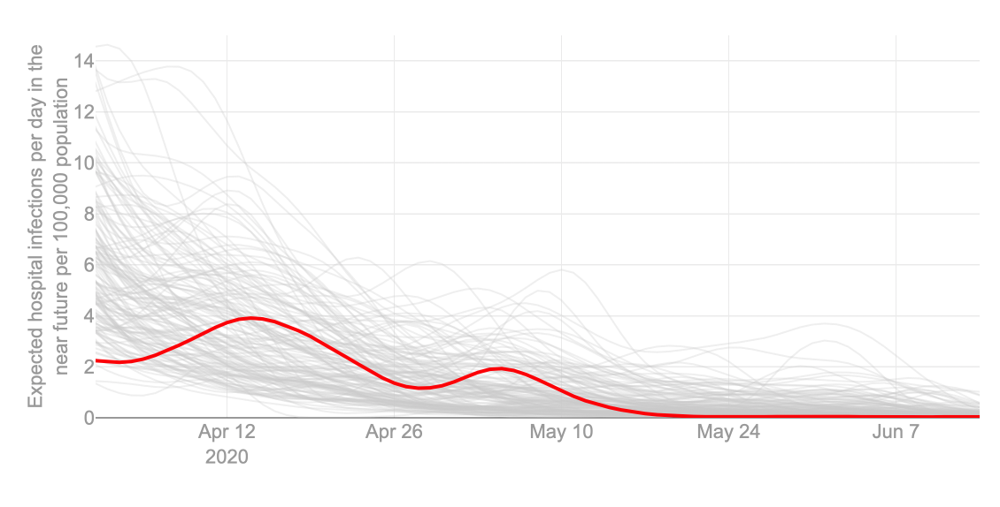

# Estimation of incidence and R from local Pillar 1 case data
### Michelle Kendall, Chris Wymant and Christophe Fraser


This code estimates incidence of new infections and the instantaneous reproduction number R in April-June across Upper Tier Local Authorities of England, as reported in our [paper](https://doi.org/10.1016/S2589-7500(20)30241-7).

## Setup

### Load packages


```r
library(tidyverse)
library(EpiEstim)
library(incidence)
library(plotly)
library(ggplot2)
```

### Load data

From the working directory, fetch the Pillar 1 daily case data:


```r
dat.UK.p1 <- read_csv("data/pillar1_case_data.csv")
```

and the population data:


```r
population.data <- read.csv("data/population_by_region.csv", stringsAsFactors = FALSE)
```


### Prepare for backcalculation of infection times from case times


```r
# zeta is the distribution for the delay from infection to case confirmation
zeta.max <- 35 # hard-code that no delays are ever longer than that
delays.considered <- seq(0, zeta.max)

# incubation period
s.meanlog <- 1.58
s.sdlog   <- 0.47
s <- function(tau) {dlnorm(tau, sdlog = s.sdlog, meanlog = s.meanlog)}
s.discrete <- vapply(delays.considered, s, numeric(1))
s.discrete <- s.discrete / sum(s.discrete)

symptom.to.swab.mean <- 5.14
symptom.to.swab.sd   <- 4.2
symptom.to.swab.shape <- symptom.to.swab.mean^2 / symptom.to.swab.sd^2
symptom.to.swab.rate <- symptom.to.swab.shape / symptom.to.swab.mean
symptom.to.swab.pdf <- function(t) {
  dgamma(t, shape = symptom.to.swab.shape, rate = symptom.to.swab.rate)
}
symptom.to.swab.discrete <- vapply(delays.considered, symptom.to.swab.pdf, numeric(1))
symptom.to.swab.discrete <- symptom.to.swab.discrete / sum(symptom.to.swab.discrete)

# Zeta is the convolution of s and symptom to swab time.
# Careful: we include day zero but vector indexing is 1-based
zeta <- rep(NA, zeta.max + 1)
for (t in delays.considered) {
  convolution.sum.range <- seq(0, t)
  zeta[[t + 1]] <- sum(s.discrete[convolution.sum.range + 1] *
                         symptom.to.swab.discrete[t - convolution.sum.range + 1])
}
zeta <- zeta / sum(zeta) # unit normalise
```

## Analysis

Filter to England (for consistent Pillar 1 reporting in this time period) and prepare global parameters of start date, last date and area names:


```r
# just England:
dat.Eng.p1 <- dat.UK.p1 %>%
  filter(Country == "England")

start.date <- as.Date("2020-04-01")
last.date <- as.Date(dat.Eng.p1$Date[[nrow(dat.Eng.p1)]]) 

areas.alphabetical <- sort(unique(dat.Eng.p1$Area)) # put areas in alphabetical order, for saving together
```

Extract the daily new cases for each area:

```r
area.incidence <- lapply(areas.alphabetical, function(area) {
  dat.area <- dat.Eng.p1[dat.Eng.p1$Area==area,]
  
  # remove any rows where "total cases" is NaN
  if (any(is.na(dat.area$TotalCases))) dat.area <- dat.area[-which(is.na(dat.area$TotalCases)),]
  
  dat.area$Date <- as.Date(as.character(dat.area$Date))
  dat.area$Incidence <- rep(0,nrow(dat.area))
  dat.area$Incidence[1] <- dat.area$TotalCases[1]
  for(row in 2:nrow(dat.area)) dat.area$Incidence[row] <- dat.area$TotalCases[row] - dat.area$TotalCases[row-1]
  
  area.linelist <- dat.area$Date[1]
  for(row in 1:nrow(dat.area)){
    if(dat.area$Incidence[row]>0){
      for(case in 1:dat.area$Incidence[row]){
        area.linelist <- c(area.linelist, dat.area$Date[row])
      }
    }
  }
  area.linelist <- area.linelist[-1]
  
  incidence(area.linelist,
            first_date = start.date,
            last_date = last.date,
            standard = FALSE)
})
```

Compute the daily new infections for each area using the backcalculation:

```r
area.incidence.backcalculation <- lapply(1:150, function(x) {
  # Get the case counts time series, fill in any missing dates, and add in dates
  # beforehand reaching back to the maximum possible delay (which induces NAs,
  # all of which we set to zero).
  
  df <- cbind.data.frame(
    "dates" = area.incidence[[x]]$dates,
    "counts" = area.incidence[[x]]$counts
  )
  df <- df %>%
    complete(dates = seq.Date(min(dates) - zeta.max, max(dates), by="day")) %>%
    replace_na(list(counts = 0))
  
  df$infections <- 0
  for (days.plus.1.since.start in seq(1, nrow(df))) {
    integration.range <- seq(days.plus.1.since.start,
                             min(nrow(df), days.plus.1.since.start + zeta.max))
    df$infections[[days.plus.1.since.start]] <-
      sum(df$counts[integration.range] *
            zeta[integration.range - days.plus.1.since.start + 1])
  }
  df
})
```

And use these to estimate the instantaneous reproduction number R for each area:


```r
t_start <- seq(2,as.numeric(last.date - start.date) + zeta.max - 5) 
t_end <- t_start + 7 - 1

area.R.backcalculated <- lapply(1:150, function(i) {
  df <- area.incidence.backcalculation[[i]]
  
  # df contains data for the region: date, swab count, inferred new infections
  # use inferred new infections to estimate R
  
  area.incidence <- cbind.data.frame(
    "dates" = df$dates,
    "I" = df$infections
  )
  
  area.R.backcalculated <- estimate_R(area.incidence, 
                                      method="parametric_si",
                                      config = make_config(list(
                                        t_start = t_start,
                                        t_end = t_end,
                                        mean_si = 5.5,  # NB now using the generation time distribution because we're using inferred times of infection, not cases
                                        std_si = 2.14,
                                        mean_prior = 1,
                                        std_prior = 1))
  )
  
  # change to mode
  area.R.backcalculated$R$`Mean(R)` <- area.R.backcalculated$R$`Mean(R)` - (area.R.backcalculated$R$`Std(R)`)^2 / area.R.backcalculated$R$`Mean(R)`
  
  area.R.backcalculated
})

# rename for convenience
area.analysis <- area.R.backcalculated
```

Finally, extract the population data by area:


```r
population.by.area <- sapply(areas.alphabetical, function(x) {
  tmp <- population.data %>% filter(Name == x)
  tmp$All.ages
})
```

## Plot

Simple manipulations of these results will reproduce the plots of our [paper](https://www.medrxiv.org/content/10.1101/2020.07.12.20151753v1.article-info) (using `ggplot2`) or our [shiny app](https://bdi-pathogens.shinyapps.io/LocalCovidTracker/) (using `plotly`). For example, this plot shows the nowcast for each area of England, with the Isle of Wight highlighted in red:


```r
projected_cases <- cbind.data.frame(
  "Dates" = unlist(lapply(1:150, function(area) area.R.backcalculated[[area]]$dates[-(1:7)] - 4)),
  "Projection" = unlist(lapply(1:150, function(area) {
    sapply(area.R.backcalculated[[area]]$R$t_end, function(i) { # the first t_end is 8
      mean(area.R.backcalculated[[area]]$I[(i-6):i]) * # average incidence over that week
        area.R.backcalculated[[area]]$R$`Mean(R)`[[which(area.R.backcalculated[[area]]$R$t_end == i)]] # last R value
    })
  }
  )),
  "Area"= unlist(lapply(1:150, function(area) rep(areas.alphabetical[[area]], nrow(area.R.backcalculated[[area]]$R))))
)

# scale per capita
projected_cases$scaled_per_capita <- sapply(1:nrow(projected_cases), function(x) {
  area <- projected_cases[x,]$Area
  pop.this.area <- population.by.area[which(areas.alphabetical == area)][[1]]
  if(length(pop.this.area)==0) NA
  else projected_cases$Projection[[x]] / pop.this.area * 100000
})

# correct the date formatting
projected_cases$Dates <- as.Date(projected_cases$Dates,  origin = as.Date("1970-01-01"))

# plot setup
f1 <- list(
  family = "Arial, sans-serif",
  size = 22,
  color = "darkgrey"
)

UTLAToHighlight <- "Isle of Wight"

nowcast.plot <- projected_cases %>%
  group_by(Area) %>%
  plot_ly(x=~Dates, y=~scaled_per_capita) %>%
  add_lines(alpha=0.3,
            color = I("lightgrey"),
            hovertemplate = paste(
              '<b>',projected_cases$Area,'</b><br>',
              '<i>%{x|%d %B}</i><br>',
              '%{y:.1f} infections per 100,000<extra></extra>')) %>%
  layout(xaxis = list(
    title = "",
    titlefont = f1,
    showticklabels = TRUE,
    tickfont = f1,
    exponentformat = "E",
    range=c(start.date, last.date - 15)
  ), 
  yaxis = list(
    title = "Expected hospital infections per day in the\nnear future per 100,000 population",
    titlefont = f1,
    showticklabels = TRUE,
    tickfont = f1,
    exponentformat = "E",
    range = c(0,15)
  ), showlegend = FALSE) %>%
  filter(Area == UTLAToHighlight) %>%
      add_lines(color = I("red"),
                line=list(width=4, alpha=1),
                hovertemplate = paste(
                  '<b>',UTLAToHighlight,'</b><br>',
                  '<i>%{x|%d %B}</i><br>',
                  '%{y:.1f} infections per 100,000<extra></extra>')) 
```

We recommend viewing the plot interactively using `plotly` so that you can zoom in and find out information about each area by hovering the mouse over them:

```r
nowcast.plot
```

For ease of viewing on GitHub we include a static version here:

